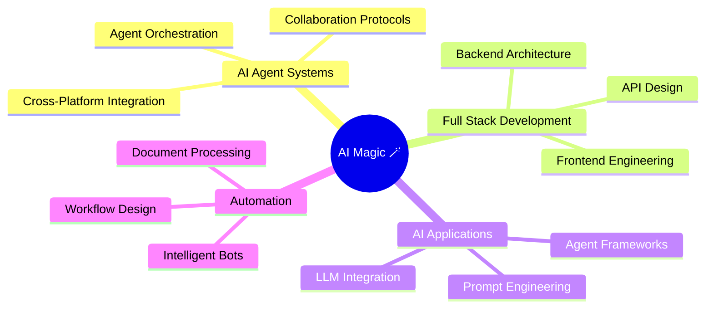

<div align="center">

# 🪄 Hi there, I'm AI_magician


[](https://github.com/TobeMagic)
[](https://github.com/TobeMagic)

</div>

---

## 👨‍🔬 About Me

我写代码，也写字。

这两件事本质上是同一件事——  
都是试图把混乱的世界，说清楚一点点。

写新奇，写好玩，写惊喜一写那藏在烟火气里的小确幸与小灵感。我相信，世间最动人的事，是与你分享的每一份有趣。

<!--
🎓 Graduate Student @ China Ocean University - Sanya Oceanographic Institution  
🔬 Researching Multi-Agent Systems, Computer Vision, SLAM, and LLM-based Agents  
🤖 Building intelligent workflows that connect AI agents across platforms  
🌏 Based in Sanya, Hainan, China
-->

```python
class AI_Magician:
    def __init__(self):
        self.name = "AI_magician"
        self.role = "AI Agent Developer & Full Stack Engineer"
        self.focus_areas = [
            "Multi-Agent Systems",
            "AI Agent Development",
            "Full Stack Development",
            "AI Applications",
            "Intelligent Automation"
        ]
        self.current_mission = "Building AI agents that think and collaborate"
        
    def magic_spell(self):
        return "Move fast, think deep, never rush 🪄"
```

---

<!--
## 🛠️ Tech Stack

### Languages


### AI & Machine Learning


### Development Tools


### Cloud & Platforms


-->

---

<!--
## 🔥 What I'm Working On

🤖 **Multi-Agent Systems** - Building collaborative AI agents that integrate across Feishu, Slack, WeChat, and Discord  
👁️ **Computer Vision & SLAM** - Researching active SLAM algorithms for robotics  
📝 **Academic Research** - Publishing papers on agent-based AI and intelligent systems  
⚙️ **Automation Workflows** - Creating intelligent bots for document processing and task automation  
🧠 **LLM Applications** - Experimenting with Claude, GPT-4, and open-source models
-->

---

## 📊 GitHub Stats

<div align="center">


</div>

---

## 🎯 Current Focus



---

<!--
## 🌟 Featured Projects

### 🤖 [Project Name 1]
> Brief description of your multi-agent collaboration project
- 🔧 **Tech**: Python, LangChain, OpenAI API
- ⭐ **Highlights**: Cross-platform agent communication, automated workflows

### 📷 [Project Name 2]
> Brief description of your computer vision / SLAM project
- 🔧 **Tech**: C++, Python, ROS, OpenCV
- ⭐ **Highlights**: Real-time SLAM, robotics integration
-->

---

## 📫 Connect With Me

[](mailto:daizhaoji12345@gmail.com)
[](https://github.com/TobeMagic)
[](https://tobemagic.github.io/ai-magician-blog/)
[](https://blog.csdn.net/weixin_66526635)
[](#)

---

## 💡 Random Dev Quote


---

<div align="center">

### ✨ *"The best way to predict the future is to invent it."* ✨


**Building the future, one AI trick at a time** 🪄

</div>
